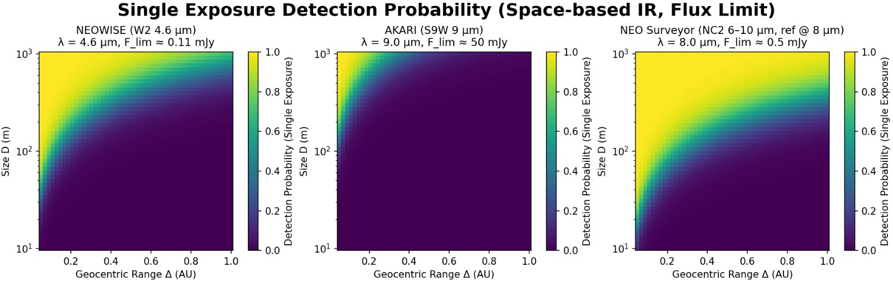

<!-- markdownlint-disable MD013 MD059 -->

# Blue Dome

MIT 1.144 [ACT4ED](https://zardini.mit.edu/act4ed/) Project, Fall 2025

## About

Applied category theory offers new opportunities to approach complex design problems in a mathematically rigorous and computationally tractable way. Properties such as compositionality and functorality of the solution map allow for design problems to be split into smaller problems, solved, and recombined into a provably optimal solution.

**Blue Dome** is our Fall 2025 ACT4ED project using category theory to investigate **orbital defense**. Specifically, we investigate **sensor selection** and **interception methods** to prevent **near earth objects** (NEOs) from causing harm to Earth.

## Structure

### Presentations

Presentations on our work can be found [here](./present).

### Sensor Modeling

Sensor modeling for ground-based and space-based sensors can be found [here](./py/detection_modeling/).

### Sensor Selection (Python)

Python code on determining sensor choices can be found in [py-mcdp](./py-mcdp/README.md).

### Sensor Selection (MCDPL)

MCDPL code on determining sensor choices can be found in [dome.mcdplib](./dome.mcdplib/).

### STK Simulations

ANSYS Satellite Toolbox is used for visualization of orbits and sensors. Tools to convert [JPL Horizons Ephemeris](https://ssd.jpl.nasa.gov/horizons/app.html#/) into ANSYS STK Ephemeris to create orbits of NEOs can be found in [horizons_to_stk.md](./py/horizons_preprocessing/horizons_to_stk.md).

### Proximal Motion Equations

Initial work was done on determining orbital changes based on kinetic intercepts. Equations are from [Optimal Impact Strategies for Asteroid Deflection](https://arc.aiaa.org/doi/10.2514/1.33432) by Massimiliano Vasile and Camilla Colombo.
